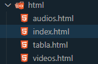
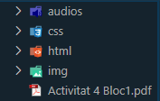
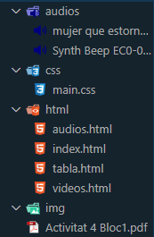
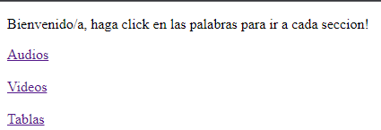
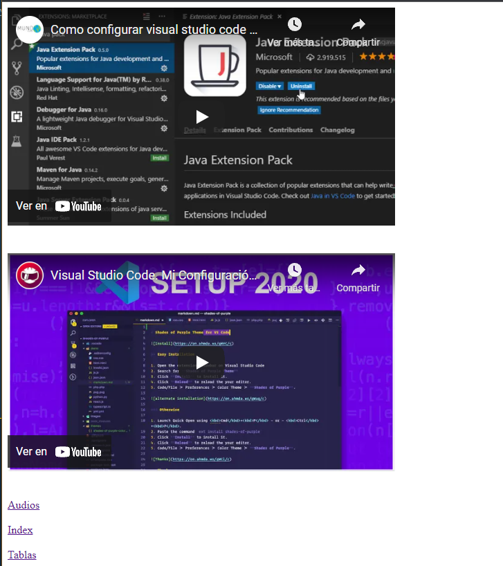
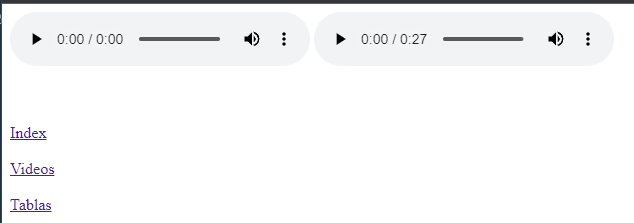
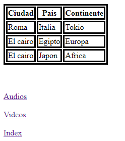

# 🌐 HTML_ACT4 🌐
---

Estos son los ejercicios de la actividad 4 de lenguajes de marcas, html 4, dia: 10/10/2021.

## Ejercicios: ⚙️

**Son unos simples ejercicios de introduccion, en los que debemos poner un index, con 4 enlaces a los diferentes directorios de la actividad
en los cuales deben entrar los audios en uno, los videos en otro y la tabla en otro.**

Esto quiere decir que tendremos un total de **4 archivos con terminacion .html**:
  
> 

- _**Estuctura**_

> 

- _**Archivos**_

> 

## Resultados: 👍

## - _**Index**_:

## - _**Videos**_:

## - _**Audios**_:

## -  _**Tabla**_:
 

### Firma 👋 
[@Izhan Lara Garcia](https://github.com/izhanlaragarcia)
