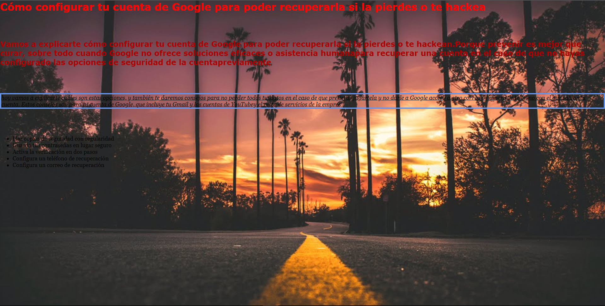

# Actividad 8 🖥️

## Configuración 🧰
- [x] Finalizado

---

## Ejercicios

[PDF](https://github.com/izhanlaragarcia/Actividades_DAW_1/blob/main/Lenguaje_de_Marcas/introduccion/actividad_8/Activitat%208%20Bloc1.pdf)

## Final

---

### Notas ⚠️

---

### Firma

✍️ [Izhan Lara Garcia](https://github/izhanlaragarcia.com)
